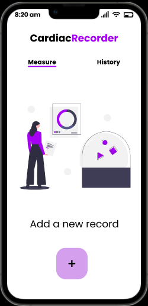
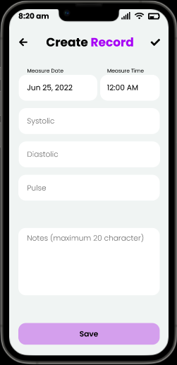
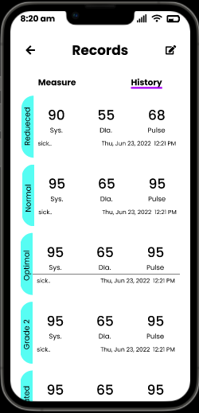
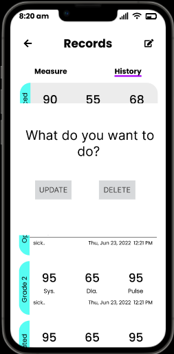

# CardiacRecorder_06_18
The app CardiacRecorder is a blood pressure and heart rate management app. It helps a user to keep track of his/her daily blood pressure and heart rate. The app assists user in data entry to avoid illegal input.Overall it is a simple app with the following features:-

1.Show a list of recorded measurements.

2.Users can add new records.

3.View and edit the details of an existing record.

4.Delete an existing record.

5.See unusual blood pressures,heart rate highlighted and flagged.

Each record has the following fields:

1.The Date he measured his pressure (presented in dd-mm-yyyy format).

2.In which time, he had measured (presented in hh-mm format).

3.Systolic Pressure in mm Hg (non-negative integer)

4.Diastolic pressure in mm Hg (non-negative integer)

5.Heart Rate in beats per minute (non-negative integer)

6.Comment (textual, upto 20 characters)

Here only comment field may be left blank for a record.

See the [wiki](https://github.com/SubahNawarMahi/CardiacRecorder_06_18/wiki) for documentation, implementation details, and history.

### Contributors:

  * [Subah Nawar(1807006)](https://github.com/SubahNawarMahi)

  * [Saimoon Al Farshi Oman (1807018)](https://github.com/saimoon-oman)
